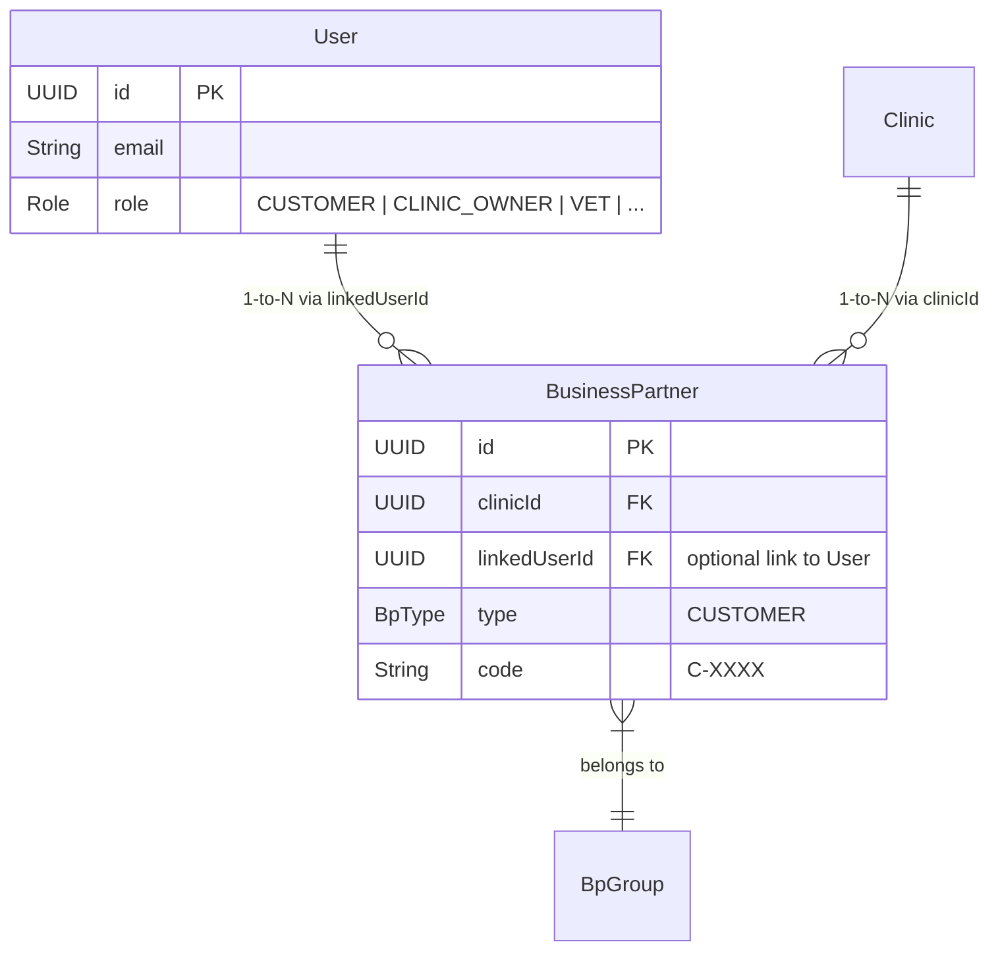

# Implementation Plan: Unified B2B/B2C Billing with 1-to-N User-to-BusinessPartner Mapping

We are updating the system architecture to support the multi-clinic pet owner model. A single `User` (B2C) can visit multiple clinics and will have one `BusinessPartner` (B2B) record per clinic. We are also adding customer self-registration, clinic counter creation auto-linking, cross-clinic data aggregation, and billing business partner overrides.

## User Review Required

> [!IMPORTANT]
> The database schema changes require removing the `businessPartnerId` column from the `users` table and adding a `linkedUserId` column to the `business_partners` table in PostgreSQL.
> Additionally, we will add a compound unique constraint `@@unique([clinicId, linkedUserId])` to the `BusinessPartner` model to prevent duplicate partners for the same user in a single clinic.

## Open Questions

*No open questions at this stage. The requirements have been clarified to support both self-registration and counter-creation.*

## Proposed Changes

### Component: Database (`packages/database`)

#### [MODIFY] [schema.prisma](file:///d:/Deaw/petiatrics/packages/database/prisma/schema.prisma)
- Add `CUSTOMER` to the `Role` enum.
- In the `User` model:
  - Remove `businessPartnerId` and the `businessPartner` relation.
  - Add `businessPartners BusinessPartner[]` relation.
- In the `BusinessPartner` model:
  - Add `linkedUserId String?`.
  - Add `user User? @relation(fields: [linkedUserId], references: [id])`.
  - Add a compound unique constraint: `@@unique([clinicId, linkedUserId])` in the model blocks.

#### [MODIFY] [seed.ts](file:///d:/Deaw/petiatrics/packages/database/src/seed.ts)
- Update seeding script to seed a dedicated B2C user (`customer@happypaws.io`) with role `CUSTOMER`.
- Create a linked `BusinessPartner` for `customer@happypaws.io` in the Happy Paws Main Branch clinic.
- Update MongoDB seeding of `Mochi` and `Luna` to set `ownerUserId` to this newly seeded Customer's ID.

### Component: Shared Types (`packages/types`)

#### [MODIFY] [enums.ts](file:///d:/Deaw/petiatrics/packages/types/src/enums.ts)
- Add `CUSTOMER = 'CUSTOMER'` to the `Role` enum.

### Component: NestJS API Backend (`apps/api`)

#### [MODIFY] [user.service.ts](file:///d:/Deaw/petiatrics/apps/api/src/modules/identity/services/user.service.ts)
- Update `linkToBusinessPartner` to set `linkedUserId` in the `BusinessPartner` table instead of `businessPartnerId` in `User`.
- Update `unlinkFromBusinessPartner` to clear `linkedUserId` in `BusinessPartner`.
- Update `assertUserLinkage` to query `BusinessPartner` where `linkedUserId === userId`.
- Implement a transactional helper `createCustomerBpWithCode(tx, userId, clinicId, name, email)` that increments the `'C-'` sequence and inserts a customer `BusinessPartner` with the correct code.
- Update `createStaff` and `invite` so that if the created user has role `CUSTOMER`, we automatically call `createCustomerBpWithCode`.

#### [MODIFY] [auth.service.ts](file:///d:/Deaw/petiatrics/apps/api/src/modules/identity/services/auth.service.ts)
- In the `login` method, resolve `businessPartnerId` for the session by querying the `BusinessPartner` table for a record matching the user's `id` and the current `clinicId`.
- Implement a public `registerCustomer(dto: RegisterCustomerDto)` method:
  - Validates password policy.
  - Hashes password.
  - Creates the `User` with role `CUSTOMER`.
  - Automatically creates and links the individual `BusinessPartner` in the specified clinic.

#### [MODIFY] [auth.controller.ts](file:///d:/Deaw/petiatrics/apps/api/src/modules/identity/controllers/auth.controller.ts)
- Create a new DTO `RegisterCustomerDto` (can be inline or in a separate file) containing `clinicId`, `name`, `email`, and `password`.
- Add a public `@Post('register-customer')` endpoint that handles self-registration for pet owners.

#### [MODIFY] [owner.controller.ts](file:///d:/Deaw/petiatrics/apps/api/src/modules/clinical/controllers/owner.controller.ts)
- Update roles restriction to `@Roles(Role.CUSTOMER)`.
- Remove the `@TenantId() clinicId` param constraint on `getPets` and other endpoints.
- Update `getPets` to query all active `BusinessPartner` records matching `linkedUserId === user.userId`, collect their `clinicId` values, and query `PatientService.findAllByOwnerCrossClinic(clinicIds, user.userId)`.
- Update detail routes (`getPetRecords`, `getPetVaccinations`, `getPetRecord`) to fetch the pet cross-clinic, verify ownership, and extract the pet's `clinicId` to scope clinical lookups.

#### [MODIFY] [patient.service.ts](file:///d:/Deaw/petiatrics/apps/api/src/modules/clinical/services/patient.service.ts)
- Add `findAllByOwnerCrossClinic(clinicIds: string[], ownerUserId: string)` to query MongoDB for pets matching `ownerUserId` in the specified clinics.
- Add `findByIdCrossClinic(id: string)` to query MongoDB for a pet by `_id` regardless of clinic.

#### [MODIFY] [visit.service.ts](file:///d:/Deaw/petiatrics/apps/api/src/modules/clinical/services/visit.service.ts)
- Add `billingBusinessPartnerId?: string | null` to `CreateVisitDto`, `UpdateVisitDto`, and `AmendVisitDto` interfaces.
- In `create`, initialize `billingBusinessPartnerId: dto.billingBusinessPartnerId ?? null`.
- In `update` and `amend`, allow updating/modifying `billingBusinessPartnerId`.

---

## Verification Plan

### Automated Tests
- Run `npm run db:migrate` and `npm run db:seed` to verify schema migrations and seeding.
- Add a NestJS integration test or spec in `apps/api/src/modules/identity/services/business-partner.service.spec.ts` or `auth.service.spec.ts` for:
  - `/auth/register-customer` customer registration path.
  - Customer counter creation (creating a CUSTOMER user creates their BP).
  - Cross-clinic owner fetching logic.
- Run tests: `npm run test` (or `npx jest` inside `apps/api`).

### Manual Verification
- Deploy database migrations.
- Register a customer user using the B2C signup route. Verify that the User is created in PostgreSQL and their BusinessPartner is successfully generated and linked.
- Verify that a front-desk staff member creating a pet owner via counter creates a linked BusinessPartner.
- Log in to the Pet Owner Portal (`/login` with customer email) and verify that the owner dashboard displays their pets.
