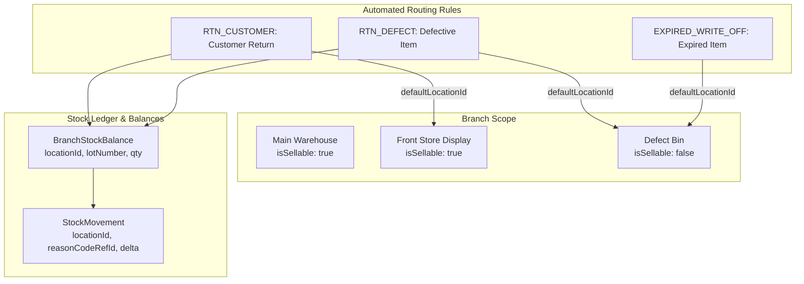

# Multi-Location Inventory Tracking & Automated Return Routing Design

## Summary

This specification documents the design and implementation of **Multi-Location Inventory Tracking** and **Automated Return Routing based on Reason Codes** in **Petiatrics**. The feature enables clinics to manage sub-locations (warehouses, retail display shelves, quarantine bins) within a branch, automate item routing based on classification codes (e.g. routing defective returns to a Defect Bin while routing good returns to sellable stock), and display location awareness in the Stock Ledger UI.

---

## Business Goals

1. **Sub-Location Management within Branch**: Enable clinics to split inventory within a branch into multiple locations (`InventoryLocation`) such as Main Warehouse, Front Store Display, and Defect/Damaged Bin.
2. **Sellable vs. Non-Sellable Stock Isolation**: Separate good inventory (`isSellable = true`) from damaged or quarantined stock (`isSellable = false`) to prevent damaged items from being sold on POS invoices.
3. **Automated Return Routing (`ReasonCode`)**: Map return/adjustment reasons (`ReasonCode`) directly to default target locations (`defaultLocationId`) so returns automatically route to the correct location without manual entry errors.
4. **Location-Aware Stock Ledger & Balances**: Update `BranchStockBalance` and `StockMovement` ledgers to record specific `locationId` and `reasonCodeRefId`.

---

## System Architecture



---

## Schema Architecture (`schema.prisma`)

### 1. `ReasonCodeType` Enum
```prisma
enum ReasonCodeType {
  RETURN
  SHRINKAGE
  EXPIRED
  DAMAGE
  ADJUSTMENT
  OTHER
}
```

### 2. `InventoryLocation` Model
```prisma
model InventoryLocation {
  id          String   @id @default(uuid())
  clinicId    String
  branchId    String
  code        String   // e.g., "MAIN_WH", "FRONT_STORE", "DEFECT_BIN"
  name        String   // e.g., "Main Warehouse", "Front Store Display", "Defect / Damaged Bin"
  description String?
  isSellable  Boolean  @default(true)
  isDefault   Boolean  @default(false)
  isActive    Boolean  @default(true)
  createdAt   DateTime @default(now())
  updatedAt   DateTime @updatedAt

  clinic             Clinic               @relation(fields: [clinicId], references: [id])
  branch             Branch               @relation(fields: [branchId], references: [id])
  stockBalances      BranchStockBalance[]
  stockMovements     StockMovement[]
  defaultReasonCodes ReasonCode[]         @relation("DefaultLocationReasonCodes")

  @@unique([clinicId, branchId, code])
  @@index([clinicId, branchId])
  @@map("inventory_locations")
}
```

### 3. `ReasonCode` Model
```prisma
model ReasonCode {
  id                String         @id @default(uuid())
  clinicId          String
  branchId          String?        // null = clinic-wide reason code
  code              String         // e.g., "RTN_DEFECT", "RTN_CUSTOMER", "EXPIRED_WRITE_OFF"
  description       String
  type              ReasonCodeType @default(RETURN)
  defaultLocationId String?        // Automated return / adjustment location routing
  isActive          Boolean        @default(true)
  createdAt         DateTime       @default(now())
  updatedAt         DateTime       @updatedAt

  clinic          Clinic             @relation(fields: [clinicId], references: [id])
  branch          Branch?            @relation(fields: [branchId], references: [id])
  defaultLocation InventoryLocation? @relation("DefaultLocationReasonCodes", fields: [defaultLocationId], references: [id], onDelete: SetNull)
  stockMovements  StockMovement[]

  @@unique([clinicId, code])
  @@index([clinicId, branchId])
  @@map("reason_codes")
}
```

### 4. `BranchStockBalance` Model Updates
- Added `locationId String?` (FK to `InventoryLocation`).
- Updated unique constraint to `@@unique([clinicId, branchId, productId, locationId, lotNumber])`.

### 5. `StockMovement` Model Updates
- Added `locationId String?` (FK to `InventoryLocation`).
- Added `reasonCodeRefId String?` (FK to `ReasonCode`).

---

## API Endpoints

### Inventory Locations
- `GET /api/v1/inventory/locations` — List locations for current branch (auto-seeds defaults if empty).
- `POST /api/v1/inventory/locations` — Create new sub-location.
- `PATCH /api/v1/inventory/locations/:id` — Update location (name, isSellable, isDefault).
- `DELETE /api/v1/inventory/locations/:id` — Deactivate sub-location.

### Reason Codes
- `GET /api/v1/inventory/reason-codes` — List reason codes with location routing.
- `POST /api/v1/inventory/reason-codes` — Create new reason code with default location mapping.
- `PATCH /api/v1/inventory/reason-codes/:id` — Update reason code & location mapping.
- `DELETE /api/v1/inventory/reason-codes/:id` — Deactivate reason code.

### Stock Ledger
- `GET /api/v1/inventory/stock/movements?locationId=:id` — Fetch stock movements filtered by location with `location` and `reasonCodeRef` relations.

---

## Frontend UI Components

1. **`InventoryLocationsClient`** (`apps/web/components/inventory/inventory-locations-client.tsx`):
   - Location CRUD interface with `Sellable (คลังปกติ)` vs `Non-Sellable (Defect Bin)` status badges and `DEFAULT` markers.
2. **`ReasonCodesClient`** (`apps/web/components/inventory/reason-codes-client.tsx`):
   - Reason code CRUD interface with `Automated Default Location Routing` dropdown.
3. **`InventoryClient`** (`apps/web/app/(clinic)/clinic/inventory/inventory-client.tsx`):
   - Integrated tab navigation: *Items*, *Stock Movements*, *Locations*, and *Reason Codes*.
