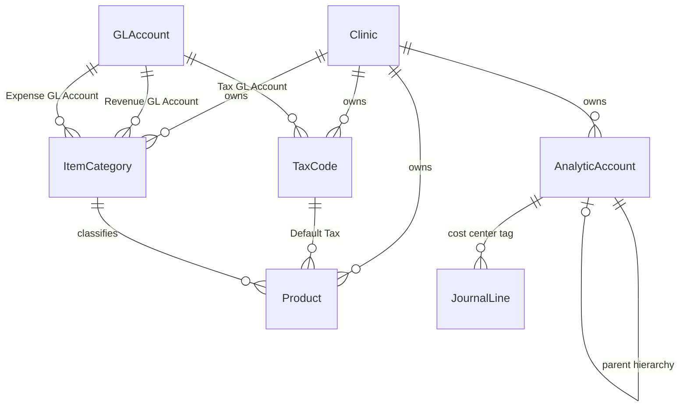

# Technical Specification: 6 Accounting & Financial Management Screens

**System**: Petiatrics Veterinary Clinic ERP  
**Module**: Accounting & Financial Management Frontend & Backend  
**Compliance**: Thailand Accounting Standards & Revenue Department Tax Regulations  
**Date**: 2026-08-10  
**Status**: APPROVED  

---

## 1. Overview

This document specifies the technical architecture, database schema extensions, backend API logic, and frontend user interfaces for the 6 core accounting screens in Petiatrics ERP:
1. Chart of Accounts (COA) Management Screen
2. Tax Configuration Screen
3. Product Categories Management Screen
4. Item Master (Products & Services) Screen
5. Analytic Accounts (Cost Centers) Screen
6. Journal Entries Screen (Manual Entry & Ledger View)

---

## 2. Database Schema Extensions (Prisma / SQL)

### Schema Models

#### 1. `TaxCode` Model (`tax_codes`)
- `id`: UUID (Primary Key)
- `clinicId`: String? (null = system default, non-null = clinic-specific override)
- `code`: String (e.g. `"VAT_7"`, `"VAT_0"`, `"NON_VAT"`, `"WHT_3"`)
- `name`: String (e.g. `"ภาษีมูลค่าเพิ่ม 7% (VAT 7%)"`, `"ยกเว้นภาษี (NON-VAT)"`)
- `rate`: Decimal `@db.Decimal(5, 2)` (e.g. `7.00`, `0.00`, `3.00`)
- `computationType`: Enum (`TAX_INCLUDED`, `TAX_EXCLUDED`)
- `glAccountId`: String? (FK `gl_accounts.id`)
- `isActive`: Boolean (Default: `true`)

#### 2. `ItemCategory` Extensions
- `revenueGlAccountId`: String? (FK `gl_accounts.id`)
- `expenseGlAccountId`: String? (FK `gl_accounts.id`)
- `inventoryAssetGlAccountId`: String? (FK `gl_accounts.id`)

#### 3. `Product` Extensions
- `itemType`: Enum (`STORABLE_PRODUCT`, `CONSUMABLE`, `SERVICE`)
- `defaultTaxCodeId`: String? (FK `tax_codes.id`)
- `defaultVatType`: Enum (`VAT_7`, `NON_VAT`)
- `isTaxInclusive`: Boolean (Default: `true`)

#### 4. `AnalyticAccount` Hierarchy
- `parentId`: String? (FK `analytic_accounts.id`)

---

## 3. Screen Specifications & User Actions

### Screen 1: Chart of Accounts (COA) Management (`/clinic/settings/chart-of-accounts`)
- **Central Layout**: 5 Category Tabs (`1000s Assets`, `2000s Liabilities`, `3000s Equity`, `4000s Revenue`, `5000s/6000s Expenses & COGS`).
- **Account Actions**: Create GL Code & Name, select Category, Account Type (`BALANCE_SHEET` vs `INCOME_STATEMENT`), and Normal Balance (`DEBIT` or `CREDIT`).
- **System Protection Guard**: System accounts (`isSystem === true`) display a locked badge and disable deletion/deactivation. Accounts linked to posted journal entries display an alert preventing deletion.

### Screen 2: Tax Configuration (`/clinic/settings/tax-codes`)
- **Tax Rules Setup**: Create/edit tax codes (VAT 7%, VAT 0%, NON-VAT, WHT 3%), set tax rate %, define computation type (`TAX_INCLUDED` vs `TAX_EXCLUDED`), and map to COA accounts (e.g. Output VAT Payable 2130, Input VAT 1150, WHT Receivable 1160).

### Screen 3: Product Categories Management (`/clinic/settings/item-categories`)
- **Category GL Mappings**: Group items and assign default GL accounts:
  - **Income Account Mapping**: Default revenue account when an item in this category is sold.
  - **Expense/COGS Account Mapping**: Default cost of goods sold/expense account when an item is consumed/sold.
  - **Inventory Asset Mapping**: Default asset account for inventory balance tracking.

### Screen 4: Item Master (Products & Services) (`/clinic/products`)
- **Registration & Tax Classification**:
  - SKU / Barcode, Item Name, Category selector (auto-inherits Category default GL mappings).
  - Item Type selector: `Storable Product` (requires FIFO valuation), `Consumable`, or `Service`.
  - Sales Price (THB) & Standard Cost (THB).
  - Tax Code selector: Enforces Thai RD compliance rules (Human medicines, medical services, diagnostics $\rightarrow$ `VAT 7%`; Registered pet medicines & pet food $\rightarrow$ `NON-VAT Exempt`).

### Screen 5: Analytic Accounts (Cost Centers) (`/clinic/settings/cost-centers`)
- **Department Taxonomy**:
  - Code & Name (e.g. `DEPT-OPD`, `DEPT-SURGERY`, `DEPT-GROOMING`, `DEPT-HOTEL`, `DEPT-PHARMACY`, `DEPT-ADMIN`).
  - **Parent/Child Hierarchy**: Support for hierarchical cost centers (sub-departments).

### Screen 6: Journal Entries Screen (Manual & View) (`/clinic/accounting/journal`)
- **Header Section**: Journal Type, Transaction Date, Accounting Date, Description, Source Reference.
- **Detail Lines Grid**: Account Code/Name selector, Debit & Credit inputs in Satang/THB, Analytic Account (Cost Center) picker, Line memo.
- **Live Balance Bar**: Real-time total debit and credit calculation with status badge (`BALANCED` vs `UNBALANCED`).
- **Action Buttons & Workflow State**:
  - **Save Draft**: Saves entry with `status: 'DRAFT'`. Remains editable & deletable.
  - **Post Entry**: Validates $\sum \text{Debit} \equiv \sum \text{Credit}$ and OPEN accounting period. Updates status to `POSTED` and generates immutable sequence document number (e.g. `JV-202608-0001`). Entire record becomes **Read-Only**.
  - **Reverse Entry**: Accessible on `POSTED` entries. Prompts for reversal reason and generates an immutable counter-entry with swapped Dr/Cr lines, marking original entry as `REVERSED`.

---

## 4. Verification & Test Plan

1. **Unit Tests**:
   - Double-entry balance engine validation ($\sum \text{Debit} \equiv \sum \text{Credit}$).
   - Tax engine calculation formulas for Tax Included vs Tax Excluded.
   - Journal reversal line swapping logic.
2. **Integration Tests**:
   - Verify category GL inheritance when registering products.
   - Verify tax code assignment and posting lock enforcement.
